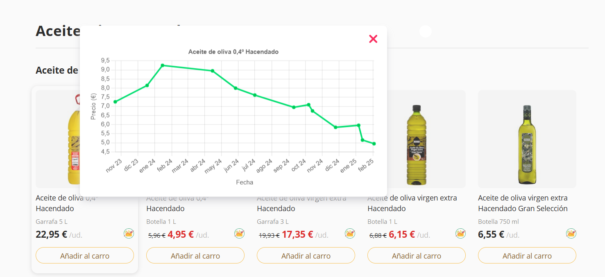

# MercaTrack

Example userscript that uses data from https://github.com/n0vella/mercadona.
A button will appear next to price in https://tienda.mercadona.es/ products, pushing it a graph with price variation of this product will be shown.
I recommend use [Violentmonkey](https://violentmonkey.github.io/) to run it.

## Screenshots

